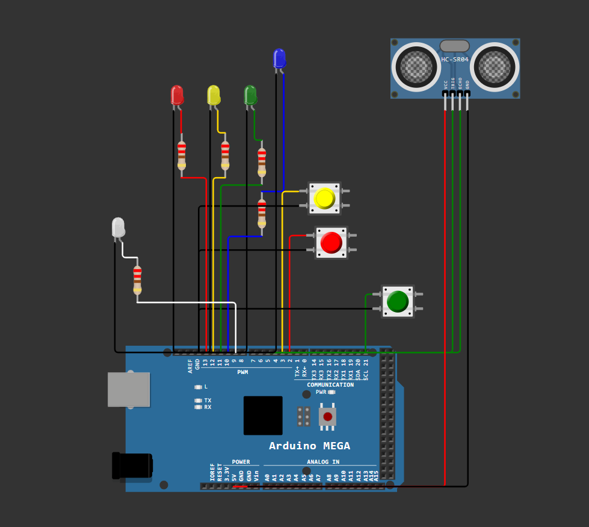

# 🚦 Arduino Interrupt Priority System

**Sustav za upravljanje višestrukim prekidima s prioritetima na Arduino Mega 2560**

-yellowgreen>)

## 📖 Sadržaj

1. [Opis zadatka](#opis-projekta)
2. [Hardverske komponente](#hardverske-komponente)
3. [Slika spojeva](#slika-spojeva)
4. [Opis rješenja](#opis-rjesenja)
5. [Zaključak](#zakljucak)

## 1. Opis zadatka

Sustav demonstrira obradu višestrukih prekida s različitim prioritetima koristeći:

- 3 tipkala za generiranje prekida (INT0, INT1, INT2)
- 3 LED-ice (crvena, žuta, zelena) za vizualizaciju prioriteta
- HC-SR04 kao senzor za udaljenost
- Timer koji sam stvara prekide
- Arduino Mega 2560 mikrokontroler

**Ključna svojstva**:

- Svaki prekid se zasebno obrađuje
- Ako se javi prekid višeg stupnja, drugi prekidi se stavljaju na čekanje
- Nakon što se izvrši prekid više razine počnu se redom izvršavati ostali prekidi (od najviše razine prema najnižoj)

## 2. Hardverske komponente

| Komponenta        | Količina | Pin na Arduino Mega |
| ----------------- | -------- | ------------------- |
| Arduino Mega 2560 | 1        | -                   |
| Tipkalo           | 3        | 2, 3, 21            |
| Crvena LED        | 1        | 13                  |
| Žuta LED          | 1        | 12                  |
| Zelena LED        | 1        | 11                  |
| Plava LED         | 1        | 10                  |
| Bijela LED        | 1        | 9                   |
| HC-SR04           | 1        | TRIG: 4, ECHO: 5    |
| Otpornik 220Ω     | 3        | -                   |

##  3. Slika spojeva

## 4. Opis rješenja

Bijela LED lampica signalizira prekid generiran pomoću timera svakih 2 sekunde. Ovaj prekid ima najviši prioritet i uvijek se izvršava prije svih ostalih.
Crvena, žuta i zelena LED lampica aktiviraju se kao odgovor na prekide generirane pritiskom na odgovarajuće tipkalo. Prekidi imaju definirani prioritet gdje crvena lampica ima najviši, zatim žuta, a zatim zelena.
Senzor udaljenosti HC-SR04 se koristi za detektiranje predmeta. Kada senzor registrira objekt bliže od 100 cm, generira se prekid najnižeg prioriteta koji pali plavu lampicu.

Svaki prekid bi trebao upaliti odgovarajuću LED lampicu kako bi korisnik mogao vidjeti da se prekid ispravno obrađuje.

- Timer prekid (bijela lampica) treba se aktivirati automatski svakih 2 sekunde.

- Pritiskom na tipkala INT0, INT1 i INT2 trebale bi se redom paliti crvena, žuta i zelena lampica.

- Kada je objekt bliže od 100 cm senzoru, plava lampica se pali kako bi signalizirala da je detekcija aktivirana.

### 4.1. Prekidi izazvani kada se pritisnu sva tipkala istovremeno

Ako korisnik istovremeno pritisne sva tri tipkala, prekidi se trebaju obrađivati po prioritetu:

- Prvo se aktivira prekid s najvišim prioritetom - crvena lampica.

- Nakon što se prekid završi, aktivira se prekid srednjeg prioriteta - žuta lampica.

- Na kraju se izvršava prekid s najnižim prioritetom - zelena lampica.

Ova testna situacija potvrđuje ispravnost očuvanja i redoslijeda izvršavanja prekida prema prioritetima.

### 4.2. Korištenje svih prekida odjednom

U slučaju da se svi prekidi generiraju istovremeno, sustav ih obrađuje u hijerarhijskom redoslijedu:

- Prvo se izvršava prekid generiran timerom jer ima najviši prioritet.

- Nakon toga slijede prekidi tipkala, redom od najvažnijeg do najmanje važnog (crvena → žuta → zelena lampica).

- Prekid senzora udaljenosti se obrađuje posljednji, budući da ima najniži prioritet.

- Ako se tijekom obrade prekida aktivira prekid višeg prioriteta, trenutno aktivni prekid se prekida i prednost se daje novom prekidu.

- Za najbolje testiranje ovog slučaja, preporučuje se:

- Pritisnuti sva tri tipkala dok je objekt ispred senzora unutar 100 cm dometa.

- Promatrati redoslijed paljenja LED lampica kako bi se vidjelo da se prekidi izvršavaju prema definiranom prioritetu.

- Nakon gašenja crvene lampice, ponovno pritisnuti tipkalo INT0 kako bi se provjerilo da ima prednost pred preostalim aktivnim prekidima.

## 5. Zakljucak

Prekidi (interrupti) su ključni mehanizam u embedded sustavima jer omogućuju:

1. **Brzi odgovor** - Mikrokontroler može trenutno reagirati na važne događaje bez čekanja u glavnoj petlji
2. **Energetsku učinkovitost** - Sustav može spavati dok se ne dogodi prekid
3. **Prioritetizaciju** - Kritični događaji se mogu obraditi prije manje važnih
