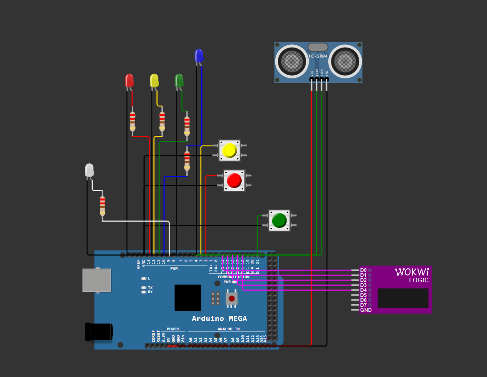

# 🚦 Arduino Interrupt Priority System

**Sustav za upravljanje višestrukim prekidima s prioritetima na Arduino Mega 2560**

-yellowgreen>)

## 游닀 Sadr쬬j

1. [Opis projekta](#opis-projekta)
2. [Hardverske komponente](#-hardverske-komponente)
3. [Slika spojeva](#-shema-spojeva)
4. [Testiranje](#-testiranje)
5. [Rezultat](#-rezultat)
6. [Moguća poboljšanja](#-moguca-poboljsanja)

## 1. Opis projekta

Sustav demonstrira obradu višestrukih prekida s različitim prioritetima koristeći:

- 3 tipkala za generiranje prekida (INT0, INT1, INT2)
- 3 LED-ice (crvena, 쬿ta, zelena) za vizualizaciju prioriteta
- Arduino Mega 2560 mikrokontroler

**Ključna svojstva**:

- Softversko upravljanje prioritetima
- Debounce za pouzdano detektiranje tipkala
- Serijski izlaz za debug informacije

## 2. Hardverske komponente

| Komponenta        | Količina | Pin na Arduino Mega |
| ----------------- | -------- | ------------------- |
| Arduino Mega 2560 | 1        | -                   |
| Tipkalo           | 3        | 2, 3, 21            |
| Crvena LED        | 1        | 13                  |
| Žuta LED          | 1        | 12                  |
| Zelena LED        | 1        | 11                  |
| Otpornik 220Ω     | 3        | -                   |

## 3. Slika spojeva

## 4. Testiranje

### 4.1. Prilikom pritiska na neku tipku ulovi se interrupt i upali se odgovarajuća ledica

### 4.2. Ako se pritisnu sve tipke od jedno, prvo će se upaliti lampica s najvišim prioritetom. Nakon što se ona ugasi, redom se pale lampice sa sve ni쬴m prioritetom.

## 5. Rezultat

## 6. Moguća poboljšanja
